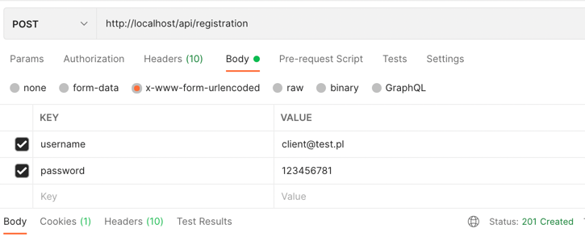

# Konfiguracja środowiska

Najpierw należy wykonać lokalnie w konsoli komende:

```
git pull https://github.com/OsmanK98/task_php_january_2022.git
```

Następnie będąc w projekcie należy uruchomić komendę:

```
docker compose up -d --build
```

Po chwili projekt jest gotowy do testowania.
Jedyna rzecz jaką należy wykonać jest konfiguracja serwera poczty w pliku .env
```
MAILER_DSN=smtp://localhost
```
Sugeruje podpiąc MailTrapa lub odkomentować linijkę wyżej przykładową konfigurację serwera SMTP

## Komenda do wyświetlenia wszystkich albumów

Jako pierwszy argument należy podać **email**, jako drugi argument należy podać **hasło** uzytkownika, w celu autoryzacji


## Przykładowe requesty:




